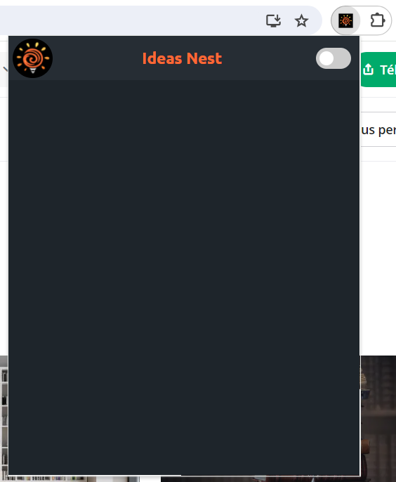
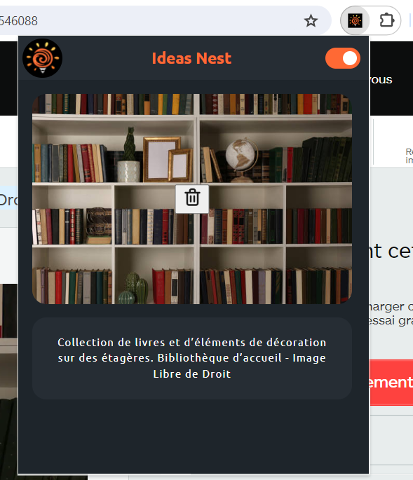

# Ideas Nest

L'extension de navigateur pour sauvegarder en quelques clics toutes tes idées glanées sur le net !

## Description

   

Ideas Nest est une extension de navigateur conçue pour Google Chrome qui utilise l'API Chrome Extension pour sauvegarder du texte et des images facilement et rapidement. Active l'extension et il ne te reste plus qu'à cliquer sur une image et/ou sélectionner du texte pour que tout s'enregistre automatiquement dans Ideas Nest.

## Projet

Ce projet a été réalisé par un groupe de 4 apprenant·e·s à l'école Ada Tech School, sur une durée de quinze jours.

## Mises à jour / améliorations envisagées

Création de dossiers pour gérer les thèmes enregistrés.
